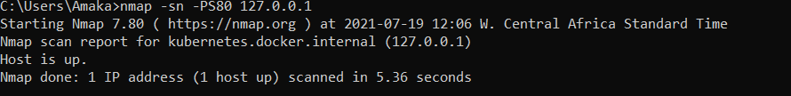

# Part 1

Icmp ping

    nmap -sP -PI 127.0.0.1

                    

tcp ping   

    nmap -sn -PS80 127.0.0.1

                     

TCP connect   

    nmap -T4 -sT 127.0.0.1

             

Stealth Scanning

    nmap -Ss 127.0.0.1

          

UDP Scanning   

    nmap -sU -v 127.0.0.1

         

Stealth FIN

    nmap -sF  127.0.0.1

Find any Vulnerabilities within your host network using vuln --script and state how you can exploit them

Command used:

    nmap -Pn --script vuln scanme.nmap.org

How I can exploit the vulnerabilities found:

The vulnerability found:
 TCP/22 ssh port
Found the following possible CSRF vulnerabilities:

Path: http://scanme.nmap.org:80/
Form id: cse-search-box-sidebar
Form action: https://nmap.org/search.html
http-dombased-xss: Couldn't find any DOM based XSS.
http-slowloris-check:

It can be exploited using the:
Slowloris DOS attack

Slowloris tries to keep many connections to the target web server open and hold them open as long as possible.  It accomplishes this by opening connections to the target web server and sending a partial request. By doing so, it starves the http server's resources causing Denial Of Service.

# Part 3

1. Generate a RSA private key and save it to a file. The command you should be using is openssl genrsa

`openssl genrsa -out techsters`

2. Generate and save a corresponding RSA public key. The command needed here is openssl rsa 

`openssl rsa -in techsters -out techsterspub`

3. Encrypt a file using your RSA public key. The command needed is openssl rsautl 

`openssl rsautl -encrypt -inkey techsterspub -pubin -in top_secret.txt -out top_secret.enc`

4. Decrypt the file using your RSA private key. Verify that the output matches the original. 

`openssl rsautl -decrypt -inkey techsters -in top_secret.enc > top1_secret.txt`

